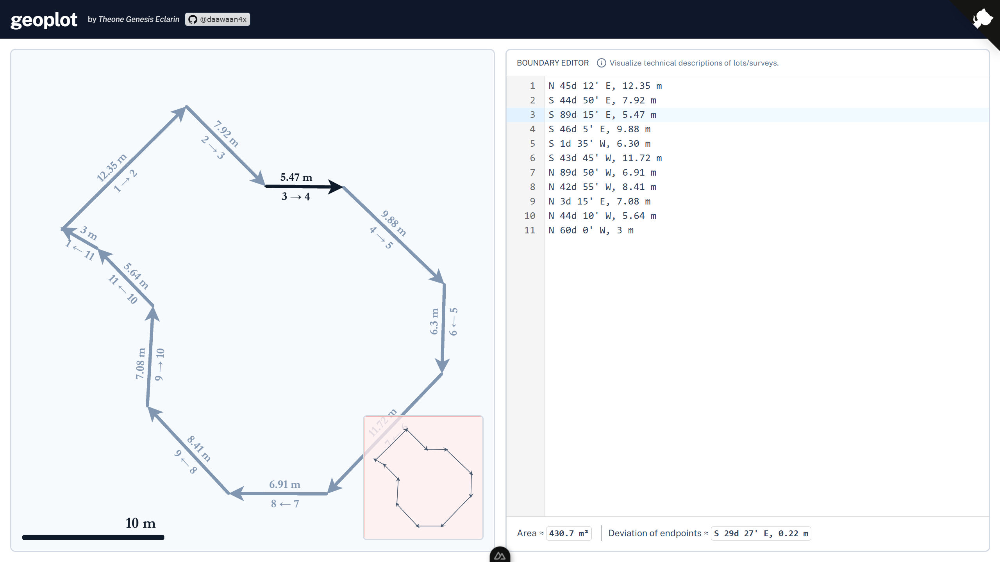

# ⛰️ geoplot

A website for visualizing technical descriptions of lots/surveys.

<div align="center">
	
</div>

## Setup

### Installation

Install the latest _NodeJS_ LTS version from the [official website](https://nodejs.org/en) or through Node Version Manager: [`nvm` for Linux](https://github.com/nvm-sh/nvm), and [`nvm-win` for Windows](https://github.com/coreybutler/nvm-windows).

Afterwards, install dependencies (preferably `pnpm`) with the following commands:

```
npm install -g pnpm
pnpm install
```

### Development Server

Start the development server with the following command.

```
pnpm run dev
```
